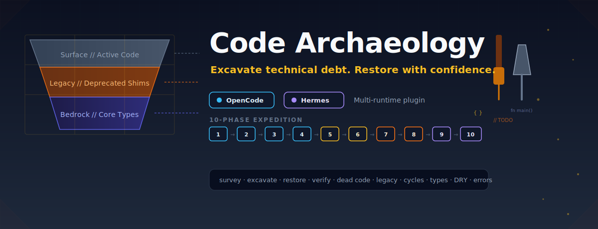
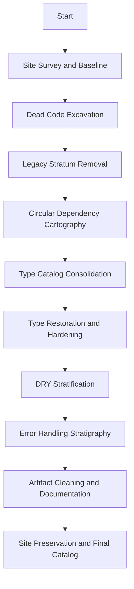
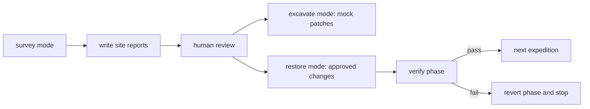

<h1 align="center">Code Archaeology</h1>

<p align="center">
  
</p>

<p align="center">
  <a href="https://github.com/Maleick/Code-Archaeology/stargazers"></a>
  <a href="https://github.com/Maleick/Code-Archaeology/commits/main"></a>
  <a href="https://github.com/Maleick/Code-Archaeology/releases"></a>
  <a href="https://www.npmjs.com/package/opencode-code-archaeology"></a>
  <a href="LICENSE"></a>
  <a href="docs/README.md"></a>
  <a href="https://github.com/sponsors/Maleick"></a>
</p>

<p align="center">
  <a href="#installation">Install</a> |
  <a href="docs/README.md">Docs</a> |
  <a href="https://github.com/Maleick/Code-Archaeology/wiki">Wiki</a> |
  <a href="#commands">Commands</a> |
  <a href="#safety-model">Safety</a> |
  <a href="#release-docs">Release</a>
</p>

Excavate technical debt. Restore with confidence.

Code Archaeology is a multi-runtime plugin that surveys, catalogs, and safely restores codebases by removing accumulated technical sediment in a fixed, test-gated expedition order. It runs on **Claude Code** (interactive slash commands), **OpenCode** (interactive slash commands), and **Hermes Agent** (cron-based background execution).

```text
+---------------------------------------------------------------+
| CODE ARCHAEOLOGY CAPABILITY PANEL                             |
+-------------------+-------------------------------------------+
| Default mode       | survey: reports only, zero source edits   |
| Review mode        | excavate: reports plus mock patches       |
| Restore mode       | applies approved changes with test gates  |
| Local state        | .archaeology/ runtime artifacts           |
| Runtimes           | Claude Code + OpenCode + Hermes Agent     |
| Platforms          | macOS/Linux (bash) + Windows (PowerShell) |
| Expedition order   | fixed stratigraphy from survey to catalog |
+-------------------+-------------------------------------------+
```

## What It Does

Code Archaeology runs a systematic excavation of a repository before it changes code. It inventories the site, identifies technical debt strata, writes reviewable reports, and only applies approved changes in `restore` mode.

- Catalogs dead code, unused exports, unreachable functions, and stale artifacts.
- Removes legacy fallbacks, deprecated shims, and compatibility layers after review.
- Maps circular dependencies before extraction or type consolidation work.
- Consolidates duplicate type definitions only after dead code and legacy layers are removed.
- Hardens weak types without guessing uncertain replacements.
- Finds semantic duplication and error-handling slop while preserving I/O boundaries.
- Produces `.archaeology/` reports that stay local to the working repository.
- Supports **Claude Code** interactive sessions, **OpenCode** interactive sessions, and **Hermes Agent** cron-based phased execution.

## Installation

### Claude Code

Copy the commands and skill into your project's `.claude/` directory:

```bash
# From the Code-Archaeology repo root
cp commands/code-archaeology*.md /path/to/your-project/.claude/commands/
mkdir -p /path/to/your-project/.claude/plugins/code-archaeology/skills/code-archaeology
cp skills/claude-code/SKILL.md \
  /path/to/your-project/.claude/plugins/code-archaeology/skills/code-archaeology/SKILL.md
```

Restart Claude Code, then run `/code-archaeology` from inside your target repository.

See [`skills/claude-code/INTEGRATION.md`](skills/claude-code/INTEGRATION.md) for global install, session flow, and troubleshooting.

### OpenCode

Paste this handoff into your agent:

```text
Run `npm pack opencode-code-archaeology@2.2.0`, extract the tarball, then open `package/INSTALL.md` from that archive and follow its instructions.
```

Recommended plugin install in `opencode.json`:

```json
{
  "plugin": [
    "opencode-code-archaeology@2.2.0"
  ]
}
```

Global npm install path:

```bash
npm install -g opencode-code-archaeology@2.2.0 && opencode-code-archaeology install && opencode-code-archaeology doctor
```

One-time package runner path, if your OpenCode setup supports package execution through Bun:

```bash
bunx opencode-code-archaeology@2.2.0 install
bunx opencode-code-archaeology@2.2.0 doctor
```

### Hermes Agent

```bash
npm install -g opencode-code-archaeology@2.2.0
cd ~/projects/Code-Archaeology
bash hooks/hermes/setup.sh

hermes cronjob create \
  --name "code-archaeology-expedition" \
  --schedule "every 15m" \
  --workdir ~/projects/Code-Archaeology \
  --prompt "Run one Code Archaeology expedition phase. Read .archaeology/session.json, execute current phase with verification, advance to next phase."
```

See [`INSTALL.md`](INSTALL.md) for prerequisites, verification, updating, and troubleshooting.

## Quick Start

### Claude Code

Run the command family from inside the repository you want to inspect:

```text
/code-archaeology
/code-archaeology --yolo
```

### OpenCode

Run the command family from inside the repository you want to inspect:

```text
/code-archaeology
/code-archaeology --yolo
```

`/code-archaeology` runs the full 10-phase survey chain without per-phase prompts. It writes reports under `.archaeology/` and makes no source-code changes. Review the reports, then choose whether to generate mock patches or apply approved changes:

```text
/code-archaeology-survey
/code-archaeology-excavate
/code-archaeology-restore
```

`--yolo` uses the full restore workflow in one shot (`yolo` mode), applying `HIGH` + `MEDIUM` confidence findings automatically.

### Hermes Agent

Each cron run executes exactly **one** phase. The runner reads `.archaeology/session.json`, runs the current phase with verification, and advances to the next phase:

```bash
bash hooks/hermes/runner.sh
```

Ten phases complete in ~2.5 hours minimum (15-minute intervals).

## Runtime Surfaces

| Feature | Claude Code | OpenCode | Hermes Agent |
|---------|-------------|----------|--------------|
| Entry | `/code-archaeology` slash command | `/code-archaeology` slash command | `cronjob` |
| Phases | All in one session | All in one session | One per cron run |
| Phase tracking | `TodoWrite` todos | Internal session state | `.archaeology/session.json` |
| Verification | Between expeditions | Between expeditions | Between every phase |
| Revert | Manual or automatic | Manual or automatic | Automatic on failure |
| Background | Not applicable | Plugin stays active | Cron resumes automatically |
| Real-time | Yes | Yes | Delayed (15-min intervals) |

## Expedition Flow



## Safety Model



- `survey` is the default and writes reports only.
- `restore` and `yolo` modify code and should run only after reports are reviewed; `yolo` applies `MEDIUM` confidence fixes with no review handoff in one pass.
- `.archaeology/` is local runtime state and should not be committed.
- Work is isolated to a configurable branch, `refactor/archaeology` by default.
- Tests and type checks gate each restore phase.
- Failed restore phases are reverted before the next expedition can proceed.
- Try/catch blocks around I/O and external input boundaries are never removed automatically.

## Commands

### Claude Code and OpenCode

| Command | Purpose | File changes |
| --- | --- | --- |
| `/code-archaeology` | Run the full 10-phase survey chain without per-phase prompts. | None outside `.archaeology/`. |
| `/code-archaeology --yolo` | Run the full 10-phase chain in unattended restore mode. | Yes, test-gated. |
| `/code-archaeology-survey` | Generate site reports for review. | None outside `.archaeology/`. |
| `/code-archaeology-excavate` | Generate reports and mock patches. | None outside `.archaeology/patches/`. |
| `/code-archaeology-restore` | Apply approved high-confidence changes. | Yes, test-gated. |

### Hermes Agent

| OpenCode Equivalent | Hermes Mechanism | File changes |
| --- | --- | --- |
| `/code-archaeology` | `cronjob` runs expedition loop | Depends on mode |
| `/code-archaeology-survey` | `mode = "survey"` in `session.json` | None outside `.archaeology/` |
| `/code-archaeology-excavate` | `mode = "excavate"` in `session.json` | None outside `.archaeology/patches/` |
| `/code-archaeology-restore` | `mode = "restore"` in `session.json` | Yes, test-gated |

## Parameters

| Parameter | Default | Description | Hermes Notes |
| --- | --- | --- | --- |
| `repo_path` | `.` | Target repository to excavate. | Set in `session.json` before first cron run. |
| `language` | `typescript` | Primary language for tooling selection. | Same |
| `mode` | `survey` | `survey`, `excavate`, `restore`, or `yolo`. | Change in `session.json` to switch modes. |
| `yolo` | `false` | Force unattended `restore` + `strict_mode` behavior in one-shot mode. | Not implemented for Hermes by default. |
| `strict_mode` | `false` | When true, restore may also apply medium-confidence findings. | Same |
| `test_command` | `npm test` | Recorded session default only; verification hooks do not execute repository-local command values. Use `CODE_ARCHAEOLOGY_TEST_COMMAND` to approve an override for the current process. | Same |
| `typecheck_command` | `npx tsc --noEmit` | Recorded session default only; verification hooks do not execute repository-local command values. Use `CODE_ARCHAEOLOGY_TYPECHECK_COMMAND` to approve an override for the current process. | Same |
| `branch_name` | `refactor/archaeology` | Branch used for isolated restore work. | Same |

## Expedition Order

The expedition order is fixed because each layer depends on the previous excavation:

1. Site Survey & Baseline
2. Dead Code Excavation
3. Legacy Stratum Removal
4. Circular Dependency Cartography
5. Type Catalog Consolidation
6. Type Restoration & Hardening
7. DRY Stratification
8. Error Handling Stratigraphy
9. Artifact Cleaning & Documentation
10. Site Preservation & Final Catalog

Do not consolidate types before dead code and legacy removal. Do not DRY code before dependency cycles are mapped.

## Language Tooling

| Language | Dead Code | Dependencies | Types | DRY |
| --- | --- | --- | --- | --- |
| TypeScript | `knip` | `madge` | `tsc` | `jscpd` |
| JavaScript | `knip` | `madge` | N/A | `jscpd` |
| Python | `vulture` | `pydeps` | `mypy` | `pylint` |
| Go | `deadcode` | `godepgraph` | `go vet` | `golangci-lint` |
| Rust | `cargo-udeps` | `cargo-deps` | `rustc` | `clippy` |

If a preferred tool is missing, Code Archaeology falls back to AST-based manual analysis and flags uncertain findings for human review.

## Architecture

```text
Code-Archaeology/
|-- assets/             # README and repository visual assets
|-- commands/           # Slash command definitions (Claude Code + OpenCode)
|-- dist/               # Built package output for GitHub-based installs
|-- docs/               # Public docs and release notes
|-- hooks/opencode/     # Init, verification, revert, and status hooks
|-- hooks/hermes/       # Setup and runner hooks for Hermes Agent
|-- plugins/            # Repo-local legacy plugin shim
|-- prompts/            # Expedition prompts by phase
|-- schema/             # JSON schemas for reports
|-- skills/             # Code Archaeology skill definitions
|   |-- code-archaeology/   # OpenCode skill
|   |-- claude-code/        # Claude Code skill and integration docs
|   `-- hermes/             # Hermes Agent skill and integration docs
|-- src/                # TypeScript source
|-- INSTALL.md          # Multi-runtime install handoff
|-- README.md           # Public project overview
`-- AGENTS.md           # Agent runtime guide
```

## Runtime Artifacts

All expedition state is written to `.archaeology/` inside the target repository:

| Artifact | Purpose |
| --- | --- |
| `session.json` | Current expedition progress and configuration. |
| `site_survey.md` | Baseline inventory and stratum graph. |
| `expedition1-report.md` through `expedition8-report.md` | Per-expedition findings. |
| `FINAL_CATALOG.md` | Final excavation summary and recommendations. |
| `excavation_log.txt` | `git diff --stat` for applied restoration work. |
| `patches/` | Mock patches generated by `excavate` mode. |
| `hermes-runtime.json` | Hermes runtime configuration (Hermes only). |

## Local Testing

For plugin development:

```bash
npm install
npm run build
npm run typecheck
npm pack --json --dry-run
bash -n hooks/opencode/*.sh
bash -n hooks/hermes/*.sh
```

For a restore expedition, run the configured test and type-check commands between phases. The bundled verification hooks are:

```bash
# OpenCode
bash hooks/opencode/verify-phase.sh final_verify

# Hermes
bash hooks/hermes/runner.sh
```

## Release Docs

- [`docs/README.md`](docs/README.md) is the documentation landing page.
- [`docs/RELEASE.md`](docs/RELEASE.md) covers release preparation and publishing.
- [`INSTALL.md`](INSTALL.md) is the raw handoff for multi-runtime installation.
- [GitHub Releases](https://github.com/Maleick/Code-Archaeology/releases) lists published versions.

## License

MIT. See [`LICENSE`](LICENSE).
