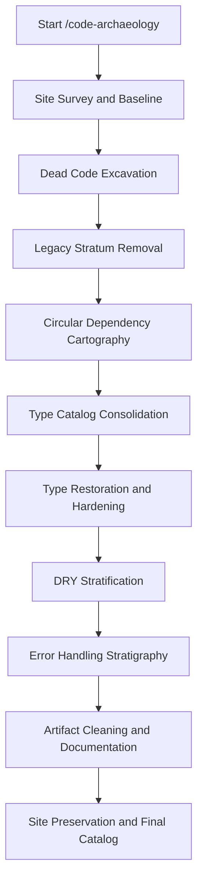
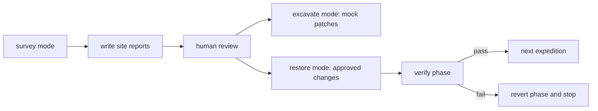

<h1 align="center">Code Archaeology</h1>

<p align="center">
  
</p>

<p align="center">
  <a href="https://github.com/Maleick/Code-Archaeology/stargazers"></a>
  <a href="https://github.com/Maleick/Code-Archaeology/commits/main"></a>
  <a href="https://github.com/Maleick/Code-Archaeology/releases"></a>
  <a href="https://www.npmjs.com/package/opencode-code-archaeology"></a>
  <a href="LICENSE"></a>
  <a href="docs/README.md"></a>
  <a href="https://github.com/sponsors/Maleick"></a>
</p>

<p align="center">
  <a href="#installation">Install</a> |
  <a href="docs/README.md">Docs</a> |
  <a href="https://github.com/Maleick/Code-Archaeology/wiki">Wiki</a> |
  <a href="#commands">Commands</a> |
  <a href="#safety-model">Safety</a> |
  <a href="#release-docs">Release</a>
</p>

Excavate technical debt. Restore with confidence.

Code Archaeology is an OpenCode plugin that surveys, catalogs, and safely restores codebases by removing accumulated technical sediment in a fixed, test-gated expedition order.

```text
+---------------------------------------------------------------+
| CODE ARCHAEOLOGY CAPABILITY PANEL                             |
+-------------------+-------------------------------------------+
| Default mode       | survey: reports only, zero source edits   |
| Review mode        | excavate: reports plus mock patches       |
| Restore mode       | applies approved changes with test gates  |
| Local state        | .archaeology/ runtime artifacts           |
| Runtime            | OpenCode plugin inside the target repo    |
| Expedition order   | fixed stratigraphy from survey to catalog |
+-------------------+-------------------------------------------+
```

## What It Does

Code Archaeology runs a systematic excavation of a repository before it changes code. It inventories the site, identifies technical debt strata, writes reviewable reports, and only applies approved changes in `restore` mode.

- Catalogs dead code, unused exports, unreachable functions, and stale artifacts.
- Removes legacy fallbacks, deprecated shims, and compatibility layers after review.
- Maps circular dependencies before extraction or type consolidation work.
- Consolidates duplicate type definitions only after dead code and legacy layers are removed.
- Hardens weak types without guessing uncertain replacements.
- Finds semantic duplication and error-handling slop while preserving I/O boundaries.
- Produces `.archaeology/` reports that stay local to the working repository.

## Installation

For OpenCode, paste this handoff into your agent:

```text
Fetch and follow instructions from https://raw.githubusercontent.com/Maleick/Code-Archaeology/refs/heads/main/INSTALL.md
```

Recommended plugin install in `opencode.json`:

```json
{
  "plugin": [
    "opencode-code-archaeology@git+https://github.com/Maleick/Code-Archaeology.git"
  ]
}
```

Global npm install path:

```bash
npm install -g opencode-code-archaeology && opencode-code-archaeology install && opencode-code-archaeology doctor
```

One-time package runner path, if your OpenCode setup supports package execution through Bun:

```bash
bunx opencode-code-archaeology install
bunx opencode-code-archaeology doctor
```

See [`INSTALL.md`](INSTALL.md) for prerequisites, verification, updating, and troubleshooting.

## Quick Start

Run the command family from inside the repository you want to inspect:

```text
/code-archaeology
```

Start non-destructively, review the reports, then choose whether to generate mock patches or apply approved changes:

```text
/code-archaeology-survey
/code-archaeology-excavate
/code-archaeology-restore
```

## Expedition Flow



## Safety Model



- `survey` is the default and writes reports only.
- `restore` modifies code and should run only after reports are reviewed.
- `.archaeology/` is local runtime state and should not be committed.
- Work is isolated to a configurable branch, `refactor/archaeology` by default.
- Tests and type checks gate each restore phase.
- Failed restore phases are reverted before the next expedition can proceed.
- Try/catch blocks around I/O and external input boundaries are never removed automatically.

## Commands

| Command | Purpose | File changes |
| --- | --- | --- |
| `/code-archaeology` | Start the full expedition in the configured mode. | Depends on mode; defaults to none. |
| `/code-archaeology-survey` | Generate site reports for review. | None outside `.archaeology/`. |
| `/code-archaeology-excavate` | Generate reports and mock patches. | None outside `.archaeology/patches/`. |
| `/code-archaeology-restore` | Apply approved high-confidence changes. | Yes, test-gated. |

## Parameters

| Parameter | Default | Description |
| --- | --- | --- |
| `repo_path` | `.` | Target repository to excavate. |
| `language` | `typescript` | Primary language for tooling selection. |
| `mode` | `survey` | `survey`, `excavate`, or `restore`. |
| `strict_mode` | `false` | When true, restore may also apply medium-confidence findings. |
| `test_command` | `npm test` | Test command run by verification hooks. |
| `typecheck_command` | `npx tsc --noEmit` | Type-check command run by verification hooks. |
| `branch_name` | `refactor/archaeology` | Branch used for isolated restore work. |

## Expedition Order

The expedition order is fixed because each layer depends on the previous excavation:

1. Site Survey & Baseline
2. Dead Code Excavation
3. Legacy Stratum Removal
4. Circular Dependency Cartography
5. Type Catalog Consolidation
6. Type Restoration & Hardening
7. DRY Stratification
8. Error Handling Stratigraphy
9. Artifact Cleaning & Documentation
10. Site Preservation & Final Catalog

Do not consolidate types before dead code and legacy removal. Do not DRY code before dependency cycles are mapped.

## Language Tooling

| Language | Dead Code | Dependencies | Types | DRY |
| --- | --- | --- | --- | --- |
| TypeScript | `knip` | `madge` | `tsc` | `jscpd` |
| JavaScript | `knip` | `madge` | N/A | `jscpd` |
| Python | `vulture` | `pydeps` | `mypy` | `pylint` |
| Go | `deadcode` | `godepgraph` | `go vet` | `golangci-lint` |
| Rust | `cargo-udeps` | `cargo-deps` | `rustc` | `clippy` |

If a preferred tool is missing, Code Archaeology falls back to AST-based manual analysis and flags uncertain findings for human review.

## Architecture

```text
Code-Archaeology/
|-- assets/             # README and repository visual assets
|-- commands/           # OpenCode slash command definitions
|-- dist/               # Built package output for GitHub-based installs
|-- docs/               # Public docs and release notes
|-- hooks/opencode/     # Init, verification, revert, and status hooks
|-- plugins/            # OpenCode plugin entry point
|-- prompts/            # Expedition prompts by phase
|-- schema/             # JSON schemas for reports
|-- skills/             # Code Archaeology skill definition
|-- src/                # TypeScript source
|-- INSTALL.md          # OpenCode install handoff
|-- README.md           # Public project overview
`-- AGENTS.md           # Agent runtime guide
```

## Runtime Artifacts

All expedition state is written to `.archaeology/` inside the target repository:

| Artifact | Purpose |
| --- | --- |
| `session.json` | Current expedition progress and configuration. |
| `site_survey.md` | Baseline inventory and stratum graph. |
| `expedition1-report.md` through `expedition8-report.md` | Per-expedition findings. |
| `FINAL_CATALOG.md` | Final excavation summary and recommendations. |
| `excavation_log.txt` | `git diff --stat` for applied restoration work. |
| `patches/` | Mock patches generated by `excavate` mode. |

## Local Testing

For plugin development:

```bash
npm install
npm run build
npm run typecheck
npm pack --json --dry-run
bash -n hooks/opencode/*.sh
```

For a restore expedition, run the configured test and type-check commands between phases. The bundled verification hook is:

```bash
bash hooks/opencode/verify-phase.sh final_verify
```

## Release Docs

- [`docs/README.md`](docs/README.md) is the documentation landing page.
- [`docs/RELEASE.md`](docs/RELEASE.md) covers release preparation and publishing.
- [`INSTALL.md`](INSTALL.md) is the raw handoff for OpenCode installation.
- [GitHub Releases](https://github.com/Maleick/Code-Archaeology/releases) lists published versions.

## License

MIT. See [`LICENSE`](LICENSE).
